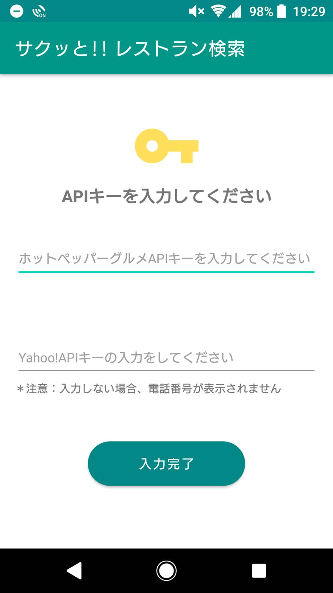
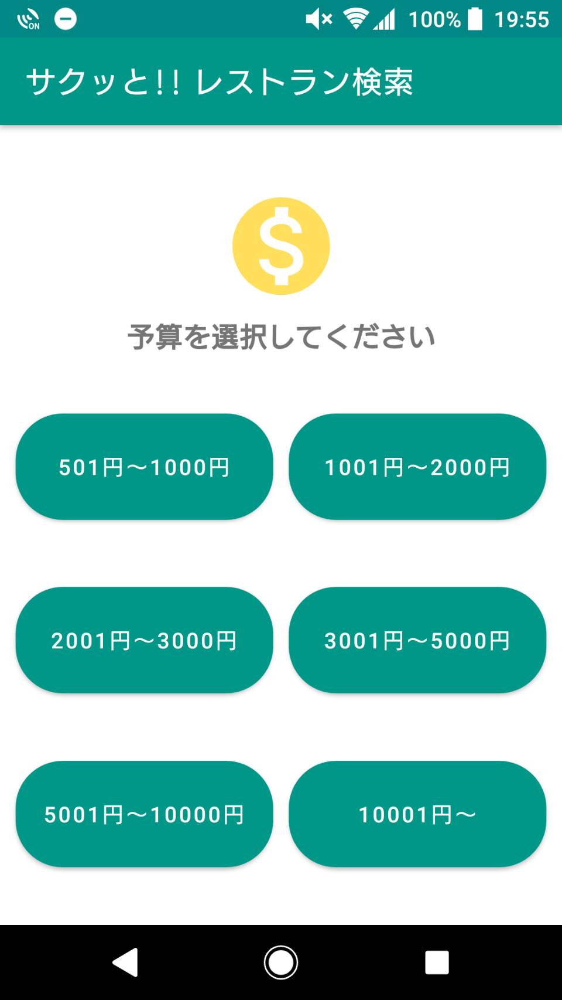
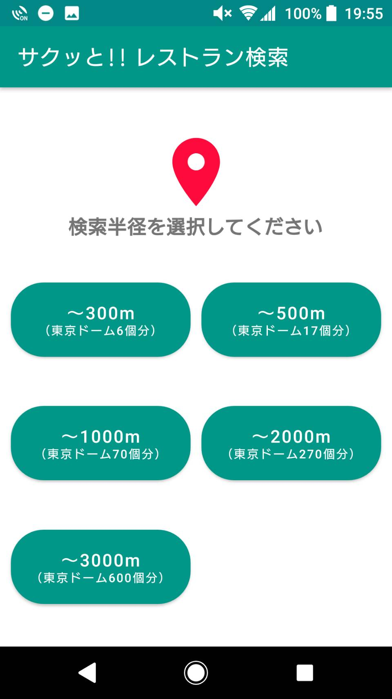
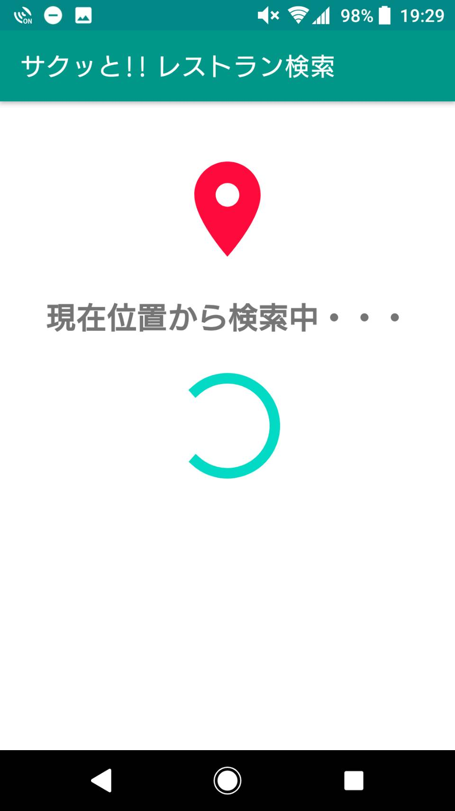
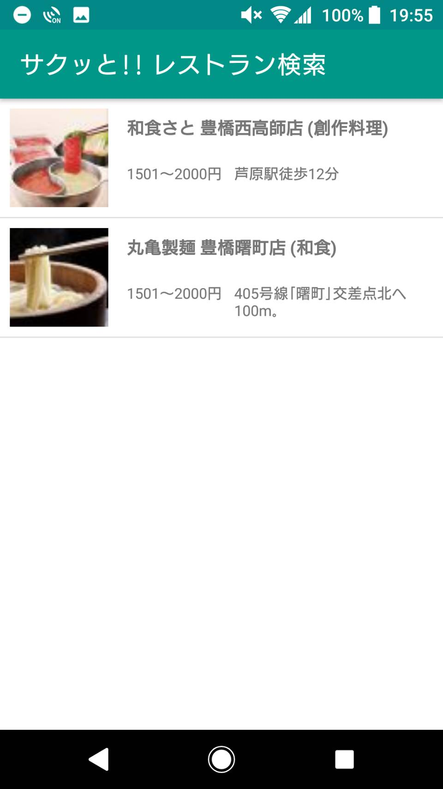
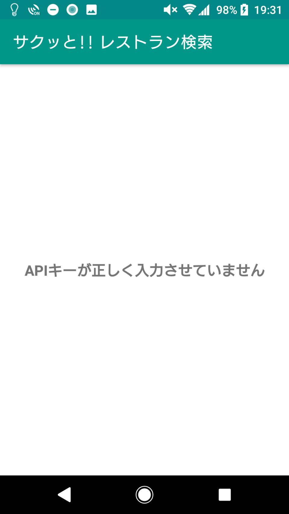
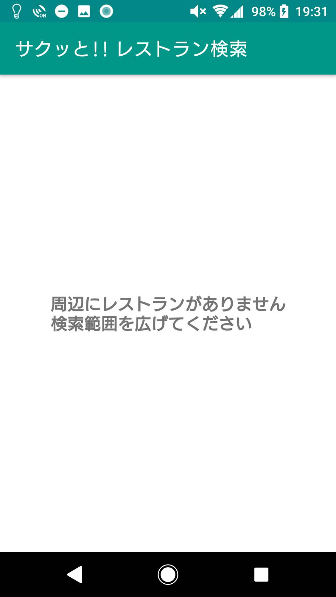
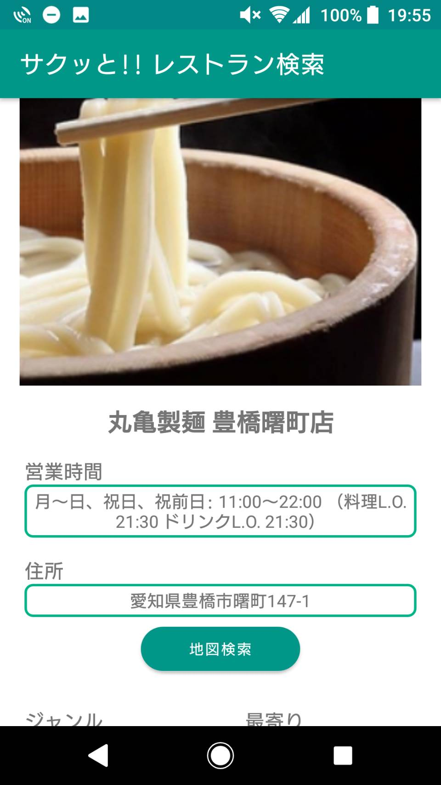

# サクッと!! レストラン検索
- 使用言語：Kotlin 1.4.30
- フレームワーク：Android Studio 4.1.2
- アーキテクチャパターン：MVVM（Model View ViewModel）
- ライブラリ・API：DataBinding・LiveData・ViewModel・Coroutine・Retrofit2・Gson・RecyclerView・Glide

## 概要
予算と検索範囲を入力して、周辺のレストランを検索するアプリです。
 子供から大人まで、誰でも使いこなせるアプリを目指しています。

## 不具合及び使用上の注意
- GPSを予めONにした状態でアプリを起動しないと、GPS検索画面（InputGPSActivity）でスピナーが永続的に回り続けます。
- ホットペッパーAPIとYahooAPIを使用するため、それぞれAPIキーが必要となります。ホットペッパーAPIのAPIキーは必須です。YahooAPIのAPIキーは必須ではなく、入力しない場合は電話番号が表示されません。

## WebAPI
使用したWebAPIを以下に示します。
 ホットペッパーグルメサーチAPI：https://webservice.recruit.co.jp/doc/hotpepper/reference.html
 Yahoo!ローカルサーチAPI：https://developer.yahoo.co.jp/webapi/map/openlocalplatform/v1/localsearch.html

## 使用動画
APIキーの入力 ⇒ 予算の選択 ⇒ 検索範囲の選択 ⇒ リストから店舗の選択 ⇒　店舗詳細の順番で動作しています。
 店舗詳細で表示される電話番号と魅力は、必ず表示されるわけではありません。
 この使用動画では、2つ目の店舗詳細でのみ、電話番号と魅力が表示されています。
 
 ''

## 使用方法
### 1. APIキーの入力
アプリを起動すると、ホットペッパーAPIキーとYahooAPIキーの入力が求められます。
 

### 2. 予算の選択
6つのボタンから、予算の選択を行います。
 

### 3. 検索範囲の選択
5つのボタンから、検索範囲の選択を行います。
 

### 4. GPSの検索
GPSの検索を行います。
 

### 5. 店舗リストの表示
選択した検索条件から、周辺のレストランを探し、リストとして表示します。
  APIキーが間違っている場合と周辺にレストランが無い場合は、それぞれエラーメッセージを表示します。
 
&emsp;
&emsp;

### 6. 店舗詳細の表示
リストから選択した店舗の詳細が表示されます。
 地図検索ボタンを押すと、住所が地図アプリに渡され、住所の地点が表示されます。
 電話番号と魅力は表示されない時があります。
 
 
 
 ＊各画面の詳細は「簡易仕様書」を拝見してください。
